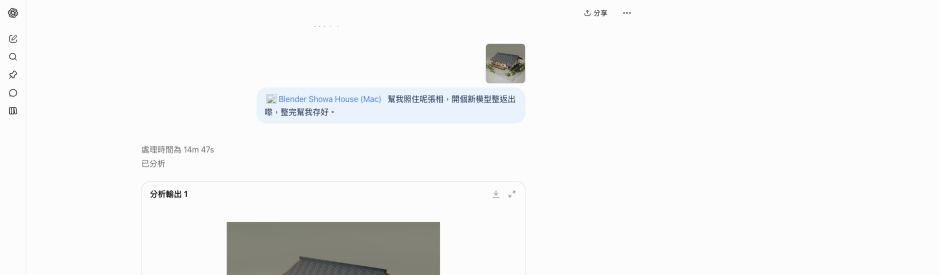
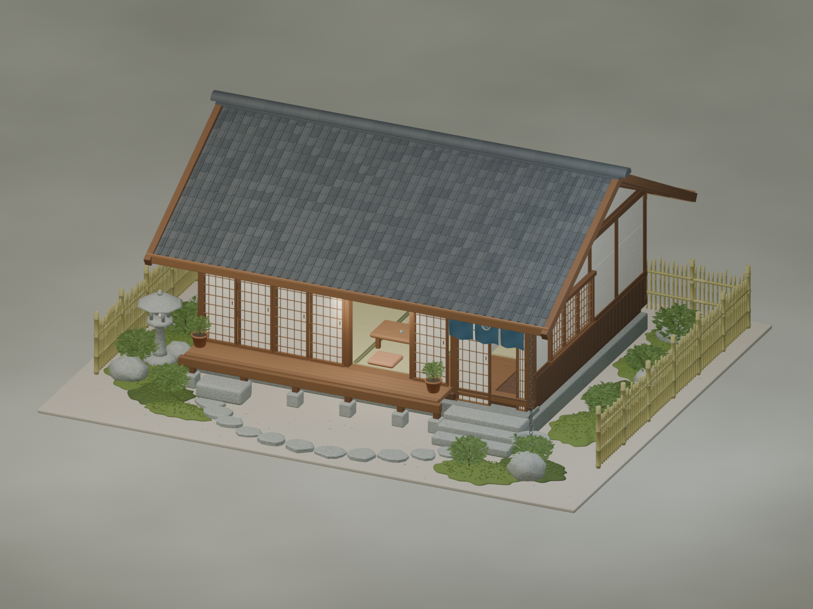
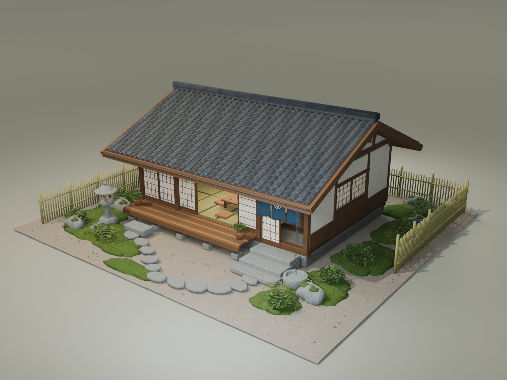
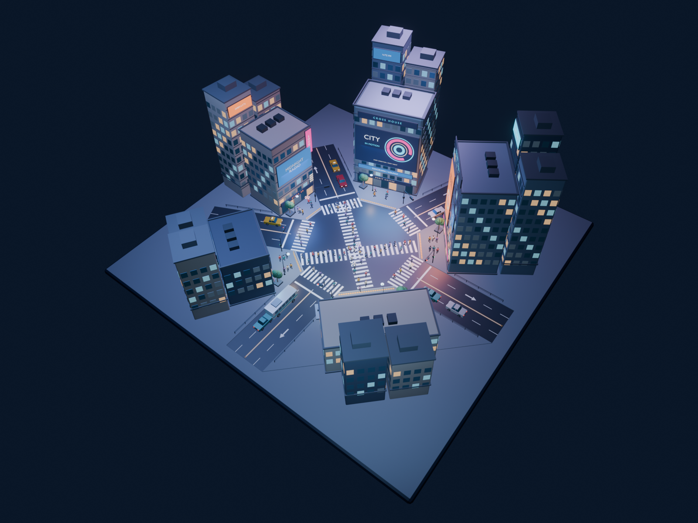

# Three historical cases / 三個真實歷史案例

These are source-documented historical runs on one Apple-silicon Mac using ChatGPT
web Pro and a private custom MCP app. **None was rerun for rc2 in this delivery.**
English descriptions below are translations, not second English-language runs.
資料來源為指定基準版本的 `docs/EXAMPLES.md`；以下是歷史證據摘要，**並非 rc2 本次驗收**。
英文是對照說明，不是聲稱另做了一次英文實測。

## 1 · Picture + one ordinary line / 配圖加一句話

The preserved original request / 保存的原文：

> 幫我照住呢張相，開個新模型整返出嚟，整完幫我存好。

The historical record describes an app chip and an attached picture, with a
14m47s modeling run. / 歷史紀錄有 App 標籤、參考圖，建模時間為 14 分 47 秒。

The initial follow-up asking for the configured save folder failed and did not
save a copy. A later natural-language retry succeeded in 1m35s. A pre-save hash of
the original was not recorded; do not claim an independently proven unchanged
original merely because the resulting copy and original differed.
首次要求另存至設定資料夾失敗，沒有副本；其後重試於 1 分 35 秒成功。沒有存檔前的原檔 hash，
不能把「副本與原檔不同」當成「已證明原檔從未改動」。

Approval: the historical operator checked the action and chose **Allow once**.
Always allow was not used. / 歷史操作曾核對後按「允許一次」，沒有選「一律允許」。

## 2 · Showa-style house, detailed brief / 昭和家屋詳細描述

**Original submitted prompt not preserved; unavailable.** No reconstruction is
presented as the original. / **原始提示詞未保存，不可得**；不重建後冒充原文。

Source-documented outcome: 1,203 objects, three 1600 × 1200 QA renders, about
24m24s. These figures were not independently remeasured here. Approval details
are not preserved for this case. / 來源記錄 1,203 物件、三張 1600 × 1200 QA 圖，約 24 分 24 秒；
本次沒有重新量測，亦沒有保存此案例的批准細節。

## 3 · Shibuya-inspired crossing, detailed brief / 涉谷靈感街口詳細描述

**Original submitted prompt not preserved; unavailable.** / **原始提示詞未保存，不可得。**

Source-documented outcome: 319 objects, 100 pedestrians and eight vehicles.
The historical recording was disclosed as 8× speed with about 19 seconds of segment
seams. It is not an uncut real-time demonstration; that video is not bundled here.
Approval details are unavailable. / 來源記錄 319 物件、100 行人、8 車；歷史錄影披露為 8 倍速，
約 19 秒分段接縫，不是無剪接實時示範，本包不附該錄影；批准細節不可得。

## Image provenance and review / 圖片來源及覆核

The images linked above are present in this repo. Their paths and SHA-256 values
are recorded in [`release-assets.json`](../release-assets.json), and the
[public approval record](../RELEASE_IMAGE_REVIEW.json) records review of the
included hashes. This updates the earlier missing-image note; it does **not**
turn historical cases into new rc2 runs. / 上述圖片已在 repo 內，路徑及
SHA-256 記於 [`release-assets.json`](../release-assets.json)，
[公開批准紀錄](../RELEASE_IMAGE_REVIEW.json)記錄了現有雜湊的覆核。
較早的圖片缺失說明已不適用，但歷史案例**沒有**因此變成 rc2 新測試。
