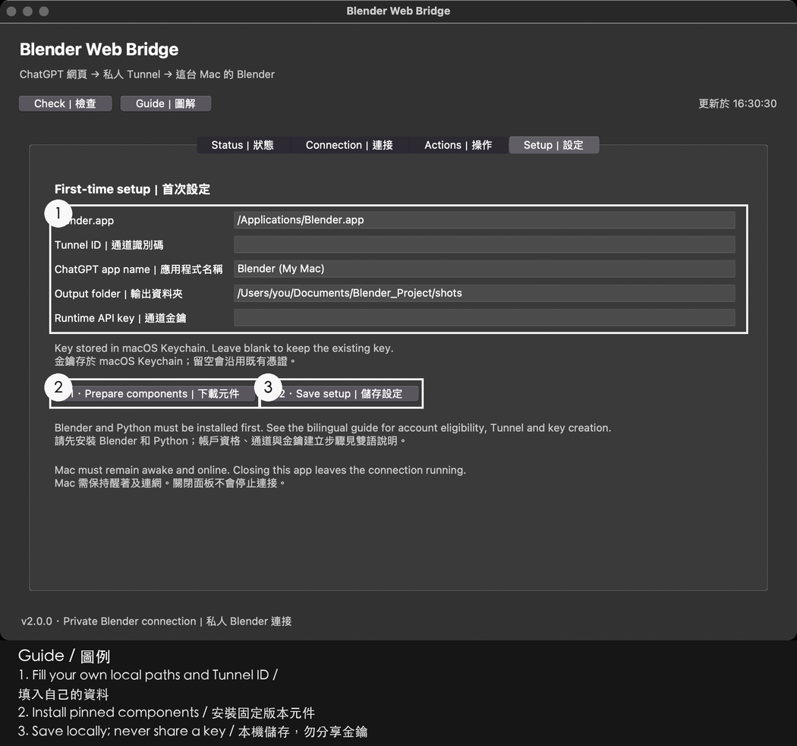
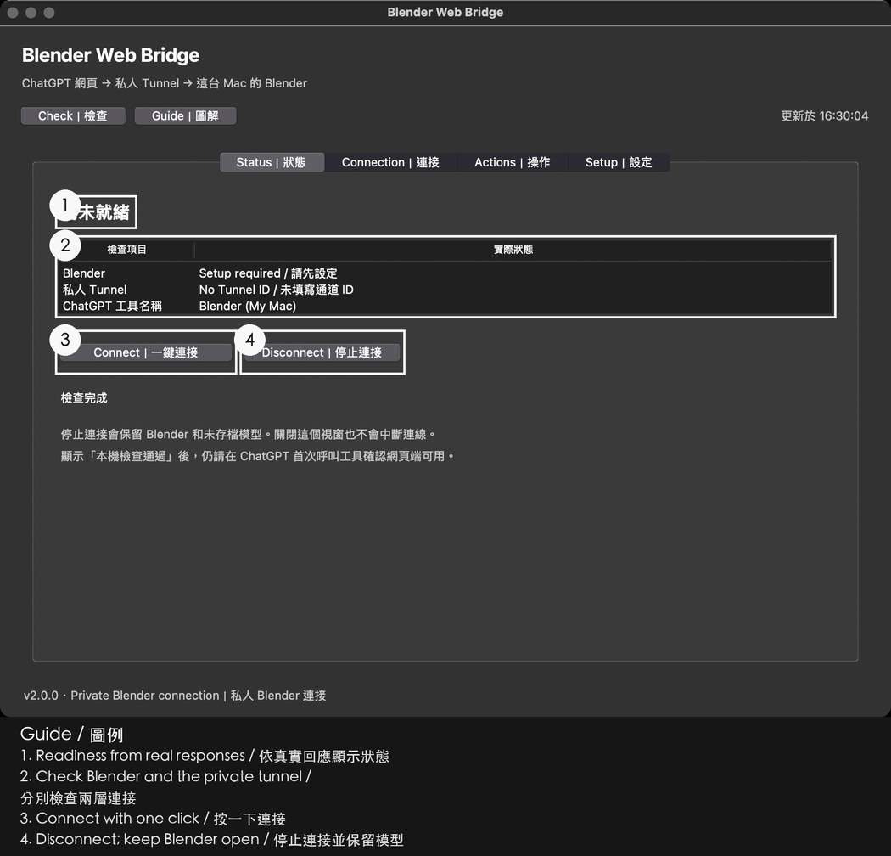
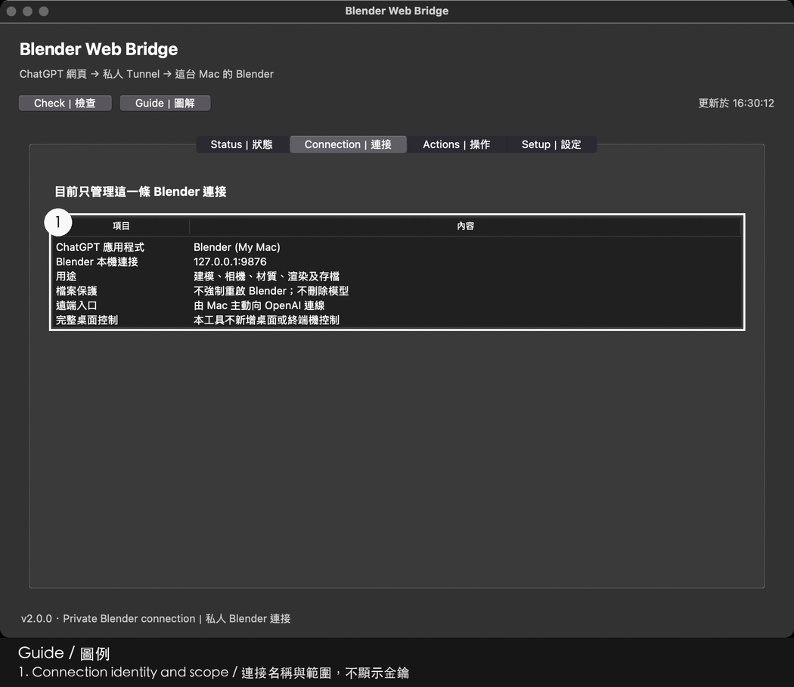

# Getting started on your Mac

This guide takes you from a downloaded repo to a real ChatGPT-to-Blender tool reply. The bridge runs on **your own Mac**; OpenAI Secure MCP Tunnel carries requests from the ChatGPT web app to the local Python bridge. It is a per-user controller, not a hosted Blender service. The annotated `setup-tab-*.png` pictures below are **historical guide images, not screenshots of this rc2 interface**; follow the current button labels in the text. The [setup page](SETUP_RC2.html) has the same historical images. [繁體中文版](GETTING_STARTED.zh-Hant.md) · [link map](LINKS.md).

## Step 0 — Check the prerequisites

1. Install [Blender for macOS](https://www.blender.org/download/). You should be able to open `Blender.app` yourself.
2. Install [Python for macOS](https://www.python.org/downloads/macos/) with Tk. The controller needs **Python 3.10+ with Tk**; **3.11+ is recommended**. This repo does **not** bundle Python. If you have a terminal, `python3 -c "import sys, tkinter; print(sys.version)"` is a useful check, although `Install.command` checks candidate interpreters itself.
3. Confirm that **your ChatGPT account, workspace, plan, and region** offer Secure MCP Tunnel and custom connectors. Use the [official OpenAI Secure MCP Tunnel guide](https://developers.openai.com/api/docs/guides/secure-mcp-tunnels) to provision your own tunnel and custom app through the features available to your account. Keep your own **Tunnel ID**, **runtime API key**, and **app display name** handy. This project cannot create the account, tunnel, or key and cannot grant the feature. If your plan or region does not offer tunnels, **this tool cannot be used**. The [official tunnel-client project](https://github.com/openai/tunnel-client) describes the upstream client; the bridge downloads a pinned build later.

**You should see:** Blender launches; Python/Tk is available; your custom app and tunnel exist in ChatGPT. **If not:** complete the missing upstream prerequisite first. If the feature is absent from your account or region, stop here rather than trying to fix it by changing your Mac's network. [Troubleshooting](TROUBLESHOOTING_RC2.md).

There is no screenshot of account eligibility here; check the controls shown in your own ChatGPT account. The [annotated setup page](SETUP_RC2.html) shows the later local-app workflow, using historical UI images.

## Step 1 — Download and open the repo

Choose either route:

```sh
git clone https://github.com/kingheiego/blender-web-bridge.git
cd blender-web-bridge
```

Or open the [GitHub repository](https://github.com/kingheiego/blender-web-bridge), choose **Code → Download ZIP**, unzip it, and open the extracted folder in Finder. You need the folder that directly contains `Install.command` and `install.py`; do not try to run a file from a ZIP preview.

This app is **not notarized**. If macOS says `Install.command` is from an **“unidentified developer”**, right-click (or Control-click) that file, choose **Open**, and confirm **Open** for this copy if you trust its source. The same macOS prompt may appear when opening the desktop app; use the same deliberate Open action. Do not turn off macOS security globally.

**You should see:** `Install.command` in the repo root and then a Terminal window when you open it. **If not:** check that the ZIP was extracted and Finder is showing the repo root; see the [annotated setup page](SETUP_RC2.html). There is **no screenshot of the Finder file or macOS warning** in this guide; the next picture shows the desktop app only after installation.

## Step 2 — Run Install.command

Double-click `Install.command` in Finder. It picks an installed Python with Tk, preferring 3.11+, and calls `install.py`. The installer writes files into your own macOS application-support folder and creates **`Blender Web Bridge.app` on your Desktop**. It does **not** start services, download runtime components, install Python, create a tunnel/account/key, or change VPN, routes, DNS, Tailscale, or proxy. It requires no fixed public IP.

You can run `./Install.command --check` from the repo folder for a **non-writing** Python/Tk prerequisite check. A custom CLI installation supports `python3 install.py --source … --data … --desktop …`; use paths that exist on your Mac and keep those values for rollback. Normal beginners can leave these defaults alone.

**You should see:** an installer result with `ok: true` and the Desktop `.app`. **If not:** read the visible error. If it says Python/Tk is unavailable, install a suitable official macOS Python and retry. If it reports a lock or unfinished rollback, follow [troubleshooting](TROUBLESHOOTING_RC2.md); do not delete transaction files.

There is no installer-success screenshot here. After installation, the next step shows the desktop app's Setup tab in a **historical UI reference**, not an rc2 capture.

## Step 3 — Open the desktop app and save Setup

Double-click **`Blender Web Bridge.app` on your Desktop**. Open the **Setup / 設定** tab and fill in:

| Field in the app | What to enter |
|---|---|
| `Blender.app` | The full location of the Blender app you installed. The default is `/Applications/Blender.app`; change it if yours is elsewhere. |
| `Tunnel ID / 通道 ID` | Your own **already-created** Tunnel ID from the OpenAI setup, not your API key. |
| `Tool display name / 工具顯示名稱` | The display name of your custom app, so you can recognize it in ChatGPT. |
| `Output folder / 輸出資料夾` | An **absolute path on your Mac** where you want model copies saved. Check that you have permission to use it. |
| `Existing runtime key / 已有通道金鑰` | Your own already-created runtime API key, pasted only into the masked app field. The app stores it in **macOS Keychain**, not in this repo. |

Click **Save setup / 儲存設定** while the tunnel is stopped. Existing Tunnel ID and credential bindings are intentionally preserved in this candidate; blanking or changing an existing binding is not a reset. Do not paste a key into ChatGPT, a public issue, or a screenshot.

**You should see:** **“Saved locally / 已在本機儲存設定.”** **If not:** confirm Blender.app really exists at that path, the output path is absolute, your Tunnel ID is not a key, and the tunnel is stopped. If you are changing an existing identity rather than setting up a fresh install, this release refuses that migration; see [security](SECURITY_RC2.md).



*Historical macOS app window: the Setup tab shows the Blender location, Tunnel ID, app name, output folder and masked key field. This is **not an rc2 capture**; use the current field and button names in the table above.*

## Step 4 — Prepare components

On the same Setup tab, make sure **both managed services are inactive** and click **Prepare components / 準備元件**. This first-time action downloads pinned versions of the tunnel client and other runtime components and verifies each download against its SHA-256 in `dependencies.lock.json`. It creates an isolated runtime for the Python bridge. **The installer did not do this in Step 2.**

The app **never stops a running service for you**. Stop the tunnel first and ensure its managed Blender service is inactive before preparation. Do not use Prepare components as an update button while either service is running or while you are relying on a live Blender session.

**You should see:** component preparation finish successfully before Connect. **If not:** a service-loaded refusal means you must make the services inactive yourself; a checksum mismatch must be investigated, never bypassed. Use [troubleshooting](TROUBLESHOOTING_RC2.md) and [third-party inventory](THIRD_PARTY.md).

The historical [annotated setup page](SETUP_RC2.html) shows an older interface; its Actions-tab picture does **not** show the current Prepare components button. Use the current Setup tab named above.

## Step 5 — Connect and read all four status layers

Open **Status / 狀態**, click **Connect / 一鍵連接** once, then **Check / 檢查**. Read every row independently:

| Layer | What “good” means | If it is not there |
|---|---|---|
| **1 · Blender** | A valid **local read-only** response from Blender. | Open/check Blender locally; a busy renderer or unavailable app is not a tunnel success. |
| **2 · Tunnel process** | The expected local process identity and `/readyz` are healthy. | Check setup/components; process readiness alone says nothing about the cloud. |
| **3 · Cloud** | **“Polling confirmed / 已確認輪詢”** from fresh valid poll evidence, with no newer failure. | Wait for a fresh check and inspect the displayed reason. A region-policy 403 cannot be fixed by restarting or changing your key. |
| **4 · ChatGPT web** | **You actually observed a recent tool result in ChatGPT** and recorded that observation in **Web acceptance / 網頁驗收**. | It is correctly unknown before Step 6. A local status cannot certify your web account. |

For Web acceptance, ask for two real read-only `get_scene_info` results in ChatGPT, check their scene name and object count, and record only what you observed. The record expires after five minutes, on a panel/process change, or after a prerequisite failure. It is **owner-reported**, not automatic web proof.

**You should see:** layers 1–3 become healthy before the web test; layer 4 becomes a recent observed pass only after Step 6 and your record. **If not:** read [troubleshooting](TROUBLESHOOTING_RC2.md) and the [network recovery explanation](NETWORK_RECOVERY.md). No fixed public IP is required, and the controller does not change VPN/routes/DNS/Tailscale/proxy. `launchd` is its sole supervisor and the pinned tunnel client handles retry/backoff.





*Second historical tab, shown for connection identity and scope. It is a different view from the preceding Status tab and **not an rc2 capture**; use the four rc2 rows above for status.*

## Step 6 — Refresh tools and start a new ChatGPT conversation

In ChatGPT web, open the **connector settings for your own app** and click **Refresh tools once**. Then start a **new conversation**. Use the **@ / tools** button in the composer to choose that app. You may attach a picture if you want, then write an ordinary sentence. For your first check, use a read-only question such as “What is in my current Blender scene?” and confirm that the tool actually returns the current scene. Make a second read-only `get_scene_info` request and only then record a pass in **Web acceptance**. Later, you can ask what your configured default output folder is or ask for a new save copy; verify which Blender scene is currently open before saving. The [recorded save-copy test](VERIFICATION_EVIDENCE.md) saved the open **default scene**, not an earlier model.

**You should see:** your app chip in the new conversation and a real tool reply with scene information. Record the actual result, not just the chip. **If the chip appears but no tool works:** go directly to Step 7. For examples of natural phrasing, see [historical examples](EXAMPLES_RC2.md); those cases were **not rerun for rc2**.


## Step 7 — Fix the first-run “no tools” conversation

An older conversation created during a brief tunnel outage can **“show the connector but report no tools.”** That conversation may retain an empty tool list even after the tunnel recovers. In your app's ChatGPT connector settings, click **Refresh tools once**, start a **NEW conversation**, and choose the app again with the **@ / tools** button.

**You should see:** callable tools and a real `get_scene_info` result in the new conversation. **If not:** revisit the four status layers, check your account eligibility, and follow [troubleshooting](TROUBLESHOOTING_RC2.md). This recovery is documented in [verification evidence](VERIFICATION_EVIDENCE.md); repeated refreshes of the old conversation are not a substitute for a new one.


## Step 8 — Stop, update, or roll back

Use **Stop / 停止通道** to stop **only the tunnel**; Blender and any unsaved model stay open, and Stop persists at next login. Closing the desktop panel **does not stop** a running tunnel. To update, stop the tunnel, quit the panel, obtain the updated repo, and run its `Install.command` again. The installer writes files only; you then reopen the Desktop app. The app will not stop either managed service on your behalf.

If installation reports an incomplete transaction, **keep the backup and journal files**. With the tunnel stopped, run this from the same checkout using a Python 3.10+ interpreter with Tk:

```sh
python3 install.py --rollback
```

If you installed with custom `--source`, `--data`, or `--desktop` paths, pass those **same** options to rollback. The explicit rollback operates on the latest recorded installation transaction; it is not a way to undo Blender modeling work. Check the printed result for `ok: true`. If it fails or says `rollback_incomplete`, keep all transaction files and follow [troubleshooting](TROUBLESHOOTING_RC2.md) before another install.

**You should see:** the tunnel stop while Blender stays open; after update the Desktop app opens; after rollback an explicit successful result. **If not:** use [troubleshooting](TROUBLESHOOTING_RC2.md) and do not delete recovery files.

The historical [annotated setup page](SETUP_RC2.html) uses an older Actions tab. It does **not** show the current Stop button; use **Status / 狀態** in this rc2 guide.

The documented test scope is Apple-silicon macOS, Python 3.10 + Tk, **187 passes and 2 skips**. Intel Macs, full reboot, long soak, actual VPN exit-IP rotation, notarization, and every ChatGPT plan/region remain **untested**. Read [verification evidence](VERIFICATION_EVIDENCE.md), [acceptance scope](ACCEPTANCE.md), and the [complete link map](LINKS.md).
