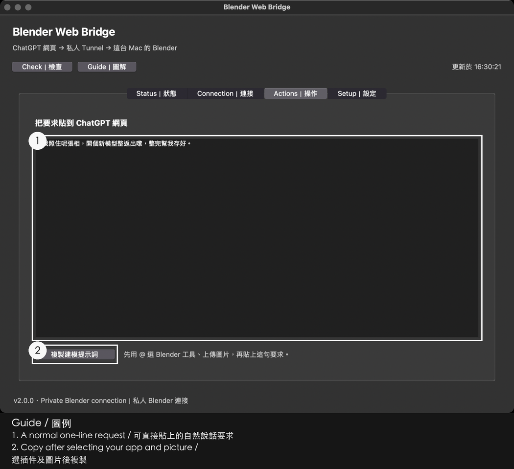

# 在自己的 Mac 開始使用

這份指南由下載 repo 開始，直到在 ChatGPT 真正收到 Blender 工具回覆。Python bridge 和桌面控制程式在**你的 Mac**運行；OpenAI Secure MCP Tunnel 將 ChatGPT 網頁要求送到本機。這不是代你託管 Blender 的服務。下列 `setup-tab-*.png` 是**舊版圖解，不是 rc2 介面的截圖**；操作時以本文列出的現行按鈕名稱為準。另可看[圖解網頁](SETUP_RC2.html)、[English guide](GETTING_STARTED.md)和[連結地圖](LINKS.md)。

## 步驟 0：確認所需條件

1. 從 [Blender 官方下載頁](https://www.blender.org/download/)安裝 macOS 版。先確認自己能開啟 `Blender.app`。
2. 從 [Python 官方 macOS 下載頁](https://www.python.org/downloads/macos/)安裝附有 Tk 的版本。控制程式需要 **Python 3.10 或以上及 Tk**，**建議 3.11 或以上**；此 repo **不附 Python**。若懂得使用 Terminal，可執行 `python3 -c "import sys, tkinter; print(sys.version)"` 檢查；`Install.command` 亦會自行找合適的 Python。
3. 確認**自己的 ChatGPT 帳戶、工作空間、方案及地區**有 Secure MCP Tunnel 和自訂連接器功能。按 [OpenAI 官方 Secure MCP Tunnel 指南](https://developers.openai.com/api/docs/guides/secure-mcp-tunnels)，在你的帳戶可用的介面中建立自己的通道和自訂 App，備妥自己的 **Tunnel ID**、**runtime API key**及 **App 顯示名稱**。本工具**不建立**帳戶、通道或金鑰，也不能開通帳戶功能。若你的方案或地區沒有通道功能，**此工具無法使用**。[官方 tunnel-client 專案](https://github.com/openai/tunnel-client)記錄上游客戶端；本工具之後會下載固定版本。

**應看到：**Blender 可開啟、Python/Tk 可用、ChatGPT 內有自己的 App 和通道。**若沒有：**先完成欠缺的上游設定。帳戶或地區不支援時應在這裏停下，不要嘗試改 Mac 的網絡設定來繞過。[故障排解](TROUBLESHOOTING_RC2.md)。


*這是歷史圖解，不能證明你的帳戶已有權限，也不是 rc2 截圖。*

## 步驟 1：下載並開啟 repo

可任選一種方法：

```sh
git clone https://github.com/kingheiego/blender-web-bridge.git
cd blender-web-bridge
```

或者開啟 [GitHub repo](https://github.com/kingheiego/blender-web-bridge)，按 **Code → Download ZIP**，解壓後在 Finder 打開資料夾。你要進入直接包含 `Install.command` 和 `install.py` 的那層；不要從 ZIP 預覽直接執行。

此 App **未經 Apple 公證**。若 macOS 表示 `Install.command` 來自**「未經識別的開發者」**，確認副本來源可信後，在該檔案上按右鍵（或 Control-click）→ **開啟** → 再確認**開啟**。首次開桌面 App 時如有相同提示，也用同樣方式確認。毋須全面關閉 macOS 安全保護。

**應看到：**repo 根目錄的 `Install.command`，開啟後出現 Terminal 視窗。**若沒有：**確認 ZIP 已解壓、Finder 位於 repo 根目錄；可看[設定圖解](SETUP_RC2.html)。以下舊圖只是下一階段的參考，並非 macOS 警告畫面。


## 步驟 2：執行 Install.command

在 Finder 雙擊 `Install.command`。它尋找已安裝、可用 Tk 的 Python，優先選 3.11 或以上，再執行 `install.py`。安裝器只在你的 macOS 帳戶支援目錄寫入檔案，並在**桌面建立 `Blender Web Bridge.app`**。它**不會**啟動服務、下載執行元件、安裝 Python、建立通道／帳戶／金鑰，亦不修改 VPN、路由、DNS、Tailscale 或 proxy。工具不要求固定公網 IP。

懂得使用 Terminal 的使用者可在 repo 內執行 `./Install.command --check`，只檢查 Python/Tk，**不寫入檔案**。自訂位置可用 `python3 install.py --source … --data … --desktop …`，並保存這些位置以供還原；一般首次安裝維持預設即可。

**應看到：**安裝結果有 `ok: true`，桌面有 `.app`。**若沒有：**讀取畫面錯誤；若提示缺少 Python/Tk，安裝適合的官方 macOS Python 再試。若顯示鎖定或還原未完成，看[故障排解](TROUBLESHOOTING_RC2.md)，不要刪除交易紀錄檔。


## 步驟 3：開啟桌面 App 並儲存設定

雙擊桌面的 **`Blender Web Bridge.app`**，開啟 **Setup / 設定**分頁：

| 程式欄位 | 應填內容 |
|---|---|
| `Blender.app` | 已安裝 Blender App 的完整位置。預設為 `/Applications/Blender.app`；放在別處就填實際位置。 |
| `Tunnel ID / 通道 ID` | 自己已建立的 Tunnel ID，**不是** API key。 |
| `Tool display name / 工具顯示名稱` | 自訂 App 的顯示名稱，方便在 ChatGPT 認出。 |
| `Output folder / 輸出資料夾` | Mac 上用於存放模型副本的**完整絕對路徑**；確認自己有權使用。 |
| `Existing runtime key / 已有通道金鑰` | 自己已取得的 runtime API key，**只**貼在程式的遮罩欄。程式將它存進 **macOS Keychain**，不寫入此 repo。 |

確定通道已停止，按 **Save setup / 儲存設定**。本候選版會保留既有 Tunnel ID 及金鑰綁定；留空或改填既有身份不是重設方法。不要把金鑰貼到 ChatGPT、公開 issue 或截圖。

**應看到：**「Saved locally / 已在本機儲存設定」。**若沒有：**檢查 `Blender.app` 是否真的在指定位置、輸出位置是否完整、Tunnel ID 是否誤填成 key，以及通道是否停止。若你想改掉既有身份，本版會拒絕該遷移；看[安全說明](SECURITY_RC2.md)。


## 步驟 4：首次準備元件

在同一個設定分頁，確保**兩個受管理服務均未運行**，按 **Prepare components / 準備元件**。首次執行會下載固定版本的通道客戶端及其他執行元件，按照 `dependencies.lock.json` 的 SHA-256 驗證，並為 Python bridge 準備隔離環境。**步驟 2 的安裝器不會代做這一步。**

程式**不會替你停止正在運行的服務**。先停止通道，並確認受管理的 Blender 服務未啟動，才準備元件。不可在依賴使用中 Blender 工作時，把此按鈕當作即時更新。

**應看到：**元件準備成功，之後才連接。**若沒有：**若提示服務已載入，須自行令服務停止；若雜湊不符，先查原因，**不可略過檢查**。[故障排解](TROUBLESHOOTING_RC2.md) · [第三方元件](THIRD_PARTY.md)。



## 步驟 5：連接並逐層檢查

在 **Status / 狀態**按一次 **Connect / 一鍵連接**，再按 **Check / 檢查**。四層須分開理解：

| 層級 | 甚麼才算正常 | 如果未正常 |
|---|---|---|
| **1 · Blender** | 收到有效的**本機唯讀**回覆。 | 本機檢查 Blender；渲染繁忙或程式未啟動，不代表通道已成功。 |
| **2 · Tunnel process / 程序** | 指定本機程序及 `/readyz` 正常。 | 檢查設定和元件；程序正常本身不能證明雲端正常。 |
| **3 · Cloud / 雲端** | **「Polling confirmed / 已確認輪詢」**，有新鮮有效的輪詢證據，而且沒有較新的失敗。 | 等待新檢查並讀取原因。地區政策 403 不會因重啟或換 key 而變成有資格。 |
| **4 · ChatGPT web / 網頁** | **你在 ChatGPT 真正看到近期工具回覆**，並在 **Web acceptance / 網頁驗收**記錄自己的觀察。 | 步驟 6 之前顯示未知屬正常；本機狀態不能代替網頁驗收。 |

網頁驗收要在 ChatGPT 真正做兩次唯讀 `get_scene_info` 查詢，核對場景名稱及物件數後才記錄。紀錄五分鐘後、面板／程序更換時或觀察到前置失敗時失效。這是**使用者回報的觀察**，不是自動驗證帳戶。

**應看到：**網頁測試前第 1–3 層正常；步驟 6 得到真實回覆並記錄後，第 4 層才有近期通過紀錄。**若沒有：**看[故障排解](TROUBLESHOOTING_RC2.md)及[網絡恢復設計](NETWORK_RECOVERY.md)。不需固定公網 IP；程式不改 VPN／路由／DNS／Tailscale／proxy。由 `launchd` 獨自監督服務；固定版本客戶端自行退避重試。


## 步驟 6：更新工具並開啟新的 ChatGPT 對話

在 ChatGPT 網頁打開**自己的 App**的連接器設定，按**一次 Refresh tools**。然後建立**新對話**，用輸入框的 **@／工具**按鈕選 App。你可附圖，再用平常說話方式提出要求。首次可先問「我目前的 Blender 場景有甚麼？」確認工具真的回傳目前場景；再要求一次唯讀 `get_scene_info`，完成後才在桌面程式的 **Web acceptance** 記錄通過。之後可以問預設輸出資料夾或要求另存副本；儲存前要核對**目前開啟的是哪個場景**。[已記錄的另存測試](VERIFICATION_EVIDENCE.md)保存的是當時開啟的**預設場景**，不是較早的模型。

**應看到：**新對話中有 App 標籤，並有真正的場景工具回覆；只見標籤不算成功。**若有標籤但工具不可用：**立即看步驟 7。[歷史案例](EXAMPLES_RC2.md)有自然語言例子，但它們**沒有在 rc2 重新執行**。


## 步驟 7：修復首次使用時「沒有工具」的舊對話

若舊對話建立時剛好遇上短暫通道中斷，便可能**「顯示連接器，但回報沒有工具」（“show the connector but report no tools”）**。通道恢復後，舊對話仍可能保留空清單。到 ChatGPT 的 App 連接器設定按**一次 Refresh tools**，開**全新對話**，再用 **@／工具**按鈕選 App。

**應看到：**新對話可呼叫工具，`get_scene_info` 有真正回覆。**若沒有：**重看四層狀態、核對帳戶資格，再看[故障排解](TROUBLESHOOTING_RC2.md)。[驗證證據](VERIFICATION_EVIDENCE.md)記錄了這次修復；在舊對話不停刷新不能代替開新對話。


## 步驟 8：停止、更新與還原

按 **Stop / 停止通道**只會停止**通道**；Blender 及未儲存模型維持開啟，下次登入仍保持停止。單純關閉桌面面板**不會**停止正在運行的通道。更新時先停止通道、關閉面板、取得新版 repo，再執行新版 `Install.command`；之後重新打開桌面 App。程式不會替你停止受管理服務。

若安裝器報告交易未完成，**保留備份及交易紀錄檔**。確認通道停止後，在同一 checkout 以具有 Tk 的 Python 3.10 或以上版本執行：

```sh
python3 install.py --rollback
```

如果自訂安裝時使用 `--source`、`--data` 或 `--desktop`，還原時須傳入**相同**的值。這項明確還原針對上一次已記錄的安裝交易，**不是** Blender 建模工作的復原功能。檢查輸出是否有 `ok: true`。若失敗或顯示 `rollback_incomplete`，保留所有交易檔，按[故障排解](TROUBLESHOOTING_RC2.md)處理，再考慮下一次安裝。

**應看到：**通道停止而 Blender 保持開啟；更新後桌面 App 可開啟；還原後有明確成功結果。**若沒有：**看[故障排解](TROUBLESHOOTING_RC2.md)，不要刪除恢復所需檔案。


已記錄的測試範圍：Apple 晶片 macOS、Python 3.10 + Tk，**187 項通過、2 項跳過**。Intel Mac、整機重啟、長時間連續運行、真實 VPN 出口 IP 輪換、公證及所有 ChatGPT 方案／地區均**未測**。見[驗證證據](VERIFICATION_EVIDENCE.md)、[驗收範圍](ACCEPTANCE.md)及[完整連結地圖](LINKS.md)。
