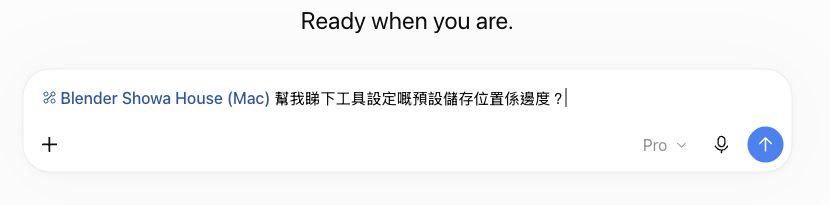
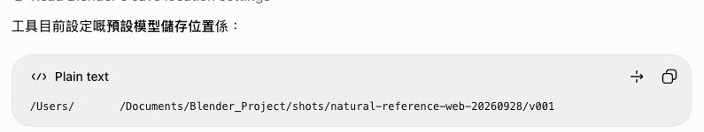
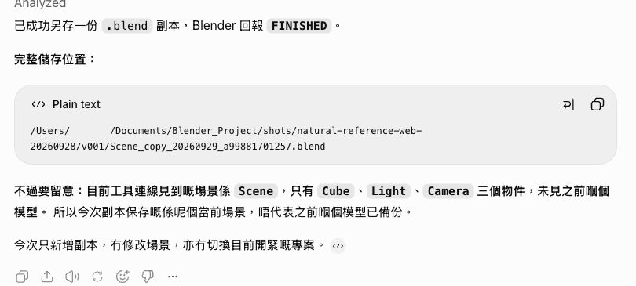
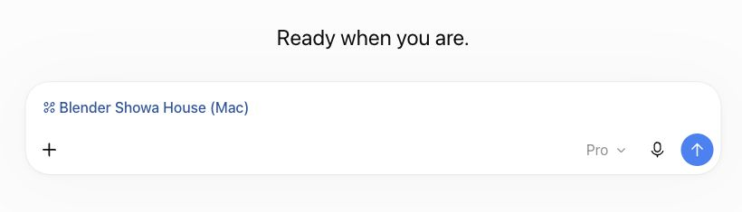
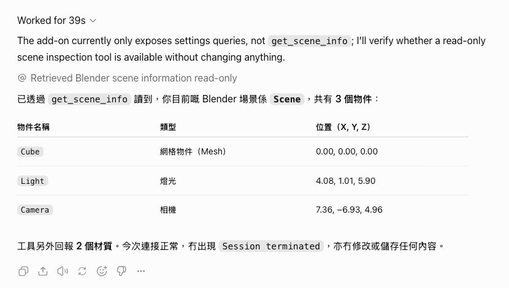

# Verification evidence / 驗證證據

Blender Web Bridge **2.0.1-rc2**, build **20102** · **2026-09-29**

These five original screenshots record the owner's ChatGPT web interaction with the
Blender connector. They may show the owner's local macOS path. The Blender project
paths shown are the owner's own and are published by the owner's choice. Image
checksums are recorded in [`EVIDENCE_SHA256.txt`](../EVIDENCE_SHA256.txt).

以下五張原始截圖記錄擁有人在 ChatGPT 網頁版使用 Blender 連接器的情況。截圖可能
顯示擁有人的 macOS 本機路徑；畫面中的 Blender 專案路徑屬擁有人所有，並由擁有人
自行選擇公開。圖片雜湊記錄於 [`EVIDENCE_SHA256.txt`](../EVIDENCE_SHA256.txt)。

## What happened / 實際經過

The connector originally appeared in an older conversation with no callable tools
because that conversation was created during a short network poll outage. The fix
was a one-click **Refresh tools** plus a new conversation. After that, a fresh
conversation listed the connector and a read-only `get_scene_info` call returned
scene **"Scene"** with **3 objects**.

連接器最初曾出現在一個舊對話中，但沒有可呼叫工具，原因是該對話建立時短暫遇上
網絡輪詢中斷。按一次 **Refresh tools** 並開啟新對話後，新的對話列出連接器；
唯讀 `get_scene_info` 呼叫回傳 **「Scene」** 場景及 **3 個物件**。

A natural-language question returned the configured save folder. A natural-language
**"save a copy"** request then wrote a real `.blend` file (**573,396 bytes**) into
that folder. **Caveat:** the saved copy was the currently-open default scene,
**not** the earlier Showa House model, because that model was not loaded at the
time. This is not evidence that the earlier model was backed up.

以自然語言詢問後，工具回覆了已設定的儲存資料夾；再以自然語言要求「另存副本」，
工具在該資料夾寫入真實 `.blend` 檔案（**573,396 bytes**）。**注意：**副本是當時
開啟的預設場景，**不是**較早前的昭和屋模型，因為當時沒有載入該模型。這不能作為
較早前模型已備份的證據。

## Screenshots / 截圖

1. **Connector chip and natural-language question / 連接器標籤與自然語言提問：**
   The composer shows the selected Blender connector and a question about the
   configured save location. 畫面顯示已選取的 Blender 連接器及對預設儲存位置的提問。

   

2. **Configured save path / 已設定的儲存路徑：**
   The reply supplies the owner's local folder path. 回覆提供擁有人的本機資料夾路徑。

   

3. **Save-copy reply / 另存副本回覆：**
   The reply reports a completed `.blend` copy and explicitly warns that the
   current scene was the default scene, not the earlier model. 回覆報告 `.blend`
   副本已完成，並明確提醒目前是預設場景，而非較早前的模型。

   

4. **New-chat connector chip / 新對話中的連接器標籤：**
   The fresh conversation composer lists the Blender connector. 新對話的輸入框
   列出 Blender 連接器。

   

5. **Read-only scene information / 唯讀場景資料：**
   The `get_scene_info` result identifies scene **"Scene"** and its three objects:
   Cube, Light and Camera. `get_scene_info` 結果顯示 **「Scene」** 場景及三個物件：
   Cube、Light、Camera。

   

## Tested scope and limits / 測試範圍與限制

Tested on **macOS Apple-silicon with Python 3.10 + Tk**. The reported test run
had **187 passing tests and 2 honest skips**. The release was **not** tested on
Intel Macs, across a full machine reboot, in a long-duration soak, under real
VPN exit-IP rotation, for notarization, or across all ChatGPT plans or regions.
The controller requires no fixed public IP, but support for any particular VPN
exit is not guaranteed.

已測試環境為 **Apple 晶片 Mac、Python 3.10 + Tk**；所記錄測試結果為
**187 項通過、2 項如實跳過**。尚未測試 Intel Mac、整機重新啟動、長時間連續運行、
真實 VPN 出口 IP 輪換、公證，以及所有 ChatGPT 方案或地區。控制器不要求固定公網
IP，但不保證任何指定 VPN 出口均可用。
