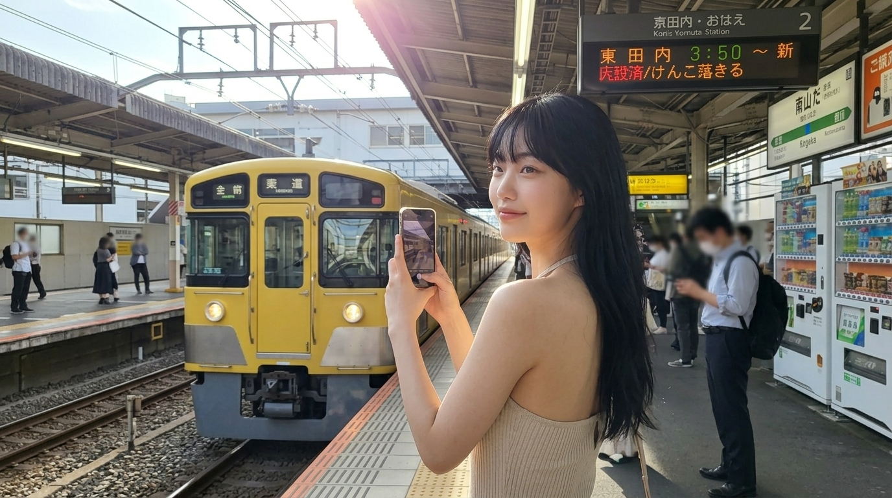
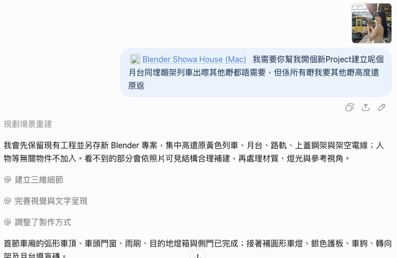
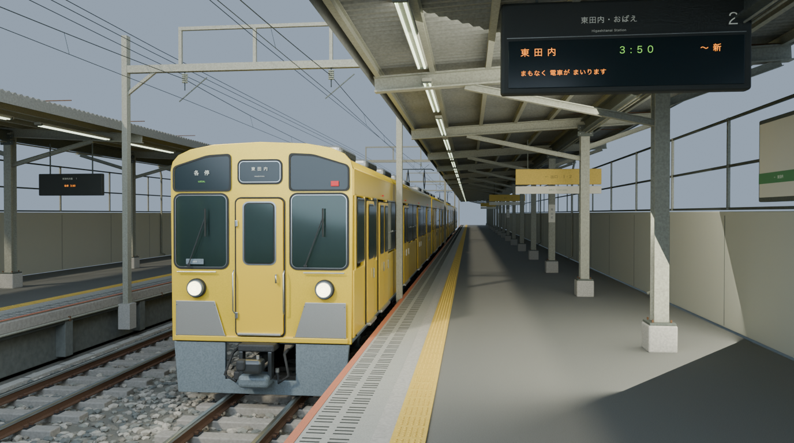
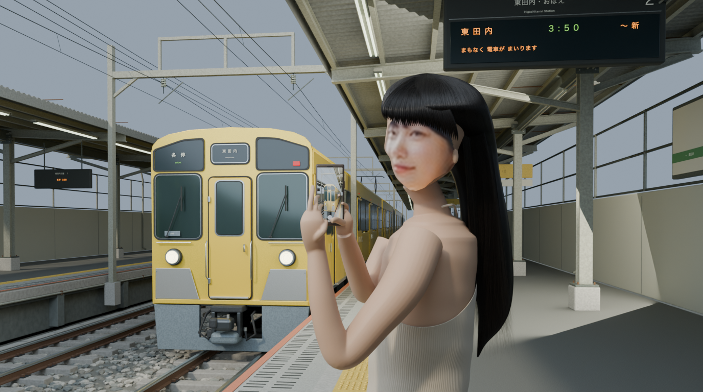

# 黃色列車月台｜場景成果與人物限制

[返回圖集](../README.md) · [遊戲廳的實際對話](../2026-10-03/conversation.md)

這是 2026-09-29 的早期案例，於 2026-10-05 從原對話及本機檔案找回，補入公開圖集。原圖由使用者再次提供；以下保留當時的真正渲染，沒有重新生成或修飾成果。

## 原本參考圖片

## 最初的實際要求

> 我需要你幫我開個新Project建立呢個月台同埋嗰架列車出嚟其他嘢都唔需要，但係所有嘢我要其他嘢高度還原返

這段是原文，保留口語。當時選取 Blender MCP 並附上圖片，要求先做月台和列車，沒有要求人物。

## 場景重建：較有展示價值的成果

這次較成功的是場景：黃色列車、路軌、月台雨棚、電子站牌和架空電線，已組成有空間層次的三維環境。仍是參考重建，光線、文字和細節並非一比一還原。

本次重新開啟純場景 `.blend`，確認 `Yellow_Train_Platform` 有 4,340 個物件、3,759 個網格物件；原檔沒有被修改。

## 追加人物挑戰：效果仍不足

使用者後來追加，希望把原圖人物及姿勢也做出來。以下是當時保留下來的真正渲染：

**人物不列為成功的寫實還原。** 臉部立體感、頭髮、手指和身體比例仍不自然；雖然有側身持手機、回頭的姿勢，與參考人物仍有明顯差距。這張是早期角色原型的限制示範，未完成可供動畫使用的角色資產。

原對話亦明確回報「仍然偏 CG 人物原型」，面部使用原圖色彩投射到立體頭部，未做動畫骨架綁定。製作期間曾斷線，恢復後續作；人物渲染也曾回傳錯誤，其後才確認圖片存在，不宣稱一次無中斷完成。

## 人物較合適的建議流程

1. 先用 **Tripo AI 等專用 3D 工具**建立人物模型，或使用已有且獲授權的角色資產。
2. 檢查面貌、拓撲、材質及身體比例，再建立骨架和蒙皮權重。
3. 匯出包含骨架的 **FBX／GLB**，匯入 Blender 後，先測試抬手、轉頭及關節彎曲。
4. 確認骨架及變形正常後，再透過 MCP 協助調整姿勢、放進場景、佈光及渲染。

這是根據本次限制提出的**建議流程，未在本案例完成端到端測試**，不保證單張圖生成角色就能高度還原本人。Tripo 官方列出自動骨架／蒙皮及含骨架 FBX、GLB 匯出能力：[Auto Rigging 說明](https://www.tripo3d.ai/features/ai-auto-rigging)（2026-10-05 核對）。

圖片與工程雜湊見 [INDEX.json](INDEX.json)。參考圖只用於這個案例對照，不因本專案採 MIT 就獲得重新使用圖片的通用授權。

---
作者：@kinghei.ego/@ai.alter（GitHub: kingheiego）
