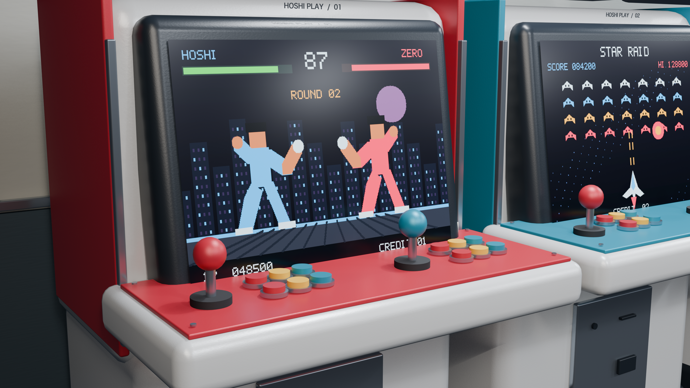
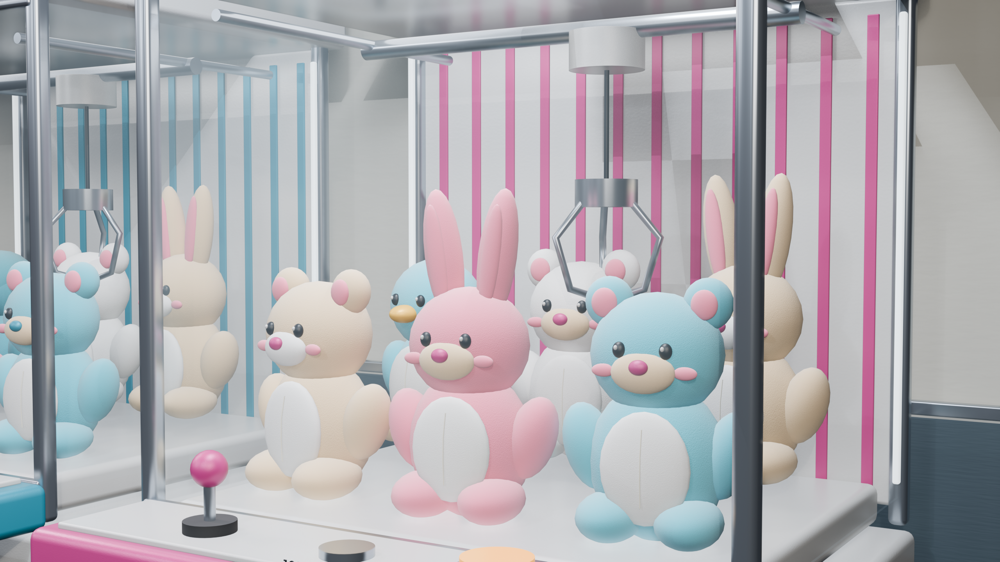
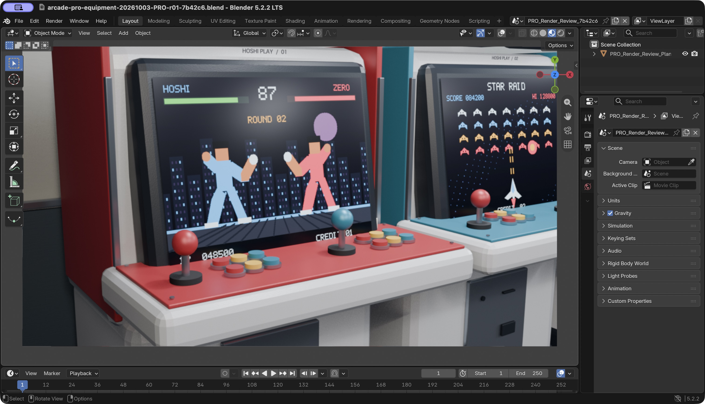

# 日本遊戲中心｜文字提示詞案例

[返回圖集](../README.md) · [下一個案例：照片參考街景](street.md)

本案例沒有提供參考圖片，從文字描述開始。展示的是 ChatGPT 網頁版 Pro 重做後，在本機 Blender 渲染的結果。

## 實際場景需求

以下為原文節錄；[完整公開版提示詞](prompts/arcade-initial.txt)僅把私人輸出路徑換成「【機舖輸出資料夾】」。

> 請在我的 Blender 建立一間完整的日本室內遊戲中心，有街機、賽車機、音樂遊戲機和夾公仔機。把按鈕、螢幕畫面、公仔、招牌、材質、貼圖和燈光都做好，呈現熱鬧、有生活感的真實機舖。完成後選好鏡頭，渲染一張室內全景和兩張細節圖，並保存可繼續編輯的 Blender 檔案。

初次嘗試使用 Medium，之後改為介面可選的最高 Pro（第 5 級／共 5 級），保留草稿，另建獨立場景。[Pro 重做指示](prompts/arcade-pro-followup.txt)亦一併保留。因此這不是「單一句話、沒有任何修正」的宣傳示例。

## 成果

### 室內全景

### 街機螢幕、搖桿與按鈕

### 夾公仔機、玻璃與吊爪

三張原尺寸均為 **2560 × 1440**。場景包含 5 台街機、2 台賽車機、2 台音樂遊戲機、3 台夾公仔機，以及 18 隻公仔，另有扭蛋機、招牌、海報和座椅。

## 實際核對

最終 `.blend` 已在獨立的 Blender 5.2.2 LTS 背景程序重新開啟，禁止自動腳本執行；作用中場景有 1,942 個物件、16 盞燈及 3 部相機，五款遊戲螢幕貼圖已打包。這是可編輯三維場景，不是只有一張展示圖片。這一段 Pro 製作的網頁回報時間為 44 分 50 秒，包含規劃、建模、修正及渲染，**不是 GPU 渲染效能測試**。

查看實際操作截圖

網頁完成回覆，已避開私人路徑：

Blender 內的渲染檢視畫面：

本案例只證明上述場景工作實際完成，不代表所有插件或所有 MCP 工具都已通過驗收。

---
作者：@kinghei.ego/@ai.alter（GitHub: kingheiego）
