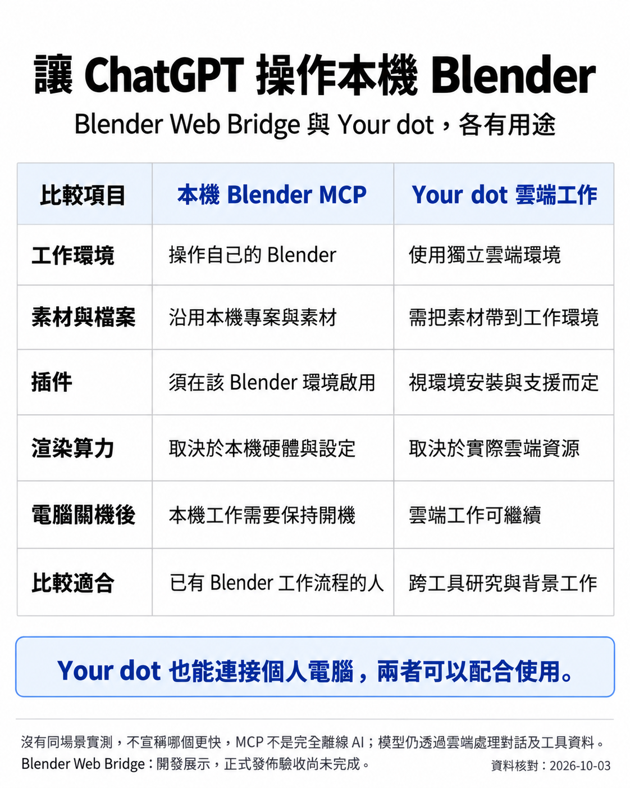

# 本機 Blender MCP 與 Your dot

[返回圖集](../README.md)

這個工具適合已有 Blender 專案、素材和本機製作流程，希望用 ChatGPT 對話協助操作的人。重點是保留可接手修改的場景，並利用自己熟悉的製作環境。

比較圖為 AI 生成資訊圖，不是渲染效能測試。讀圖時請保留以下限制：

- Your dot 也能連接個人電腦；不能把它描述成只限雲端。官方說明見 [Connect computers and apps to your dot](https://learn.chatgpt.com/docs/dots/computers-and-apps)，於 2026-10-04 核對。
- 本輪沒有測試 Your dot 搭配這個特定 MCP；「可以配合」是使用方式的判斷，不是已完成該組合驗收。
- 既有插件要在 MCP 使用的 Blender 環境啟用並個別驗證，不會自動全部可用。
- 未做同場景、同採樣、同解析度的兩邊計時，不宣稱本機一定更快。本機硬體影響 Blender 計算，不會讓雲端模型本身的推理變快。
- 本機建模不等於完全離線；提示詞、參考圖和工具回覆仍可能由雲端模型處理。

工具的安裝條件、權限和已知限制請見 [專案說明](../../../README.md)及[安全文件](../../SECURITY_RC2.md)。

---
作者：@kinghei.ego/@ai.alter（GitHub: kingheiego）
