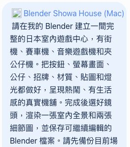
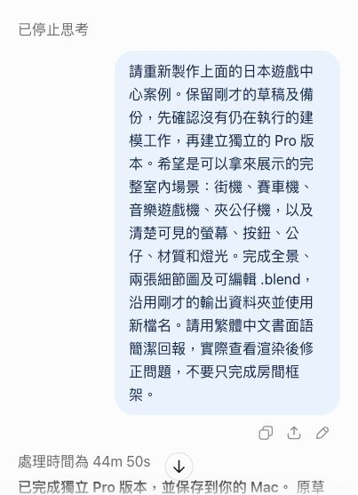
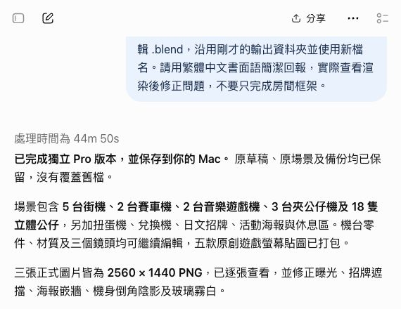
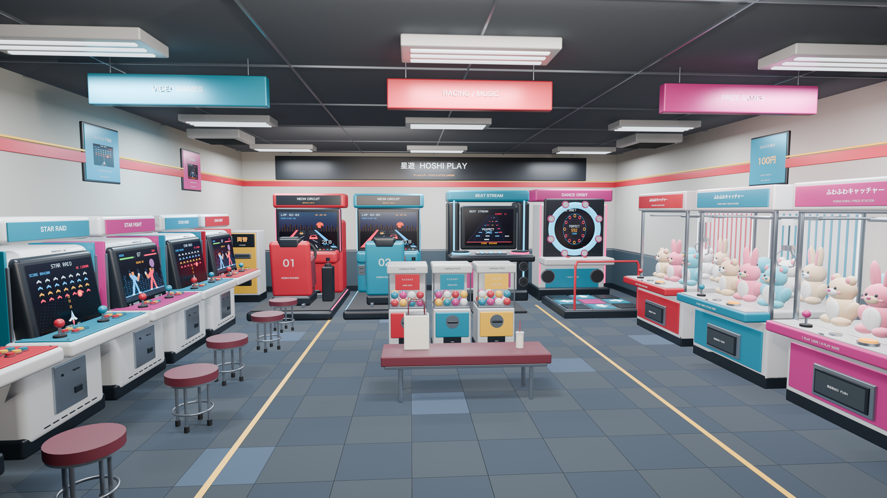

# 遊戲廳｜從提示詞到成果的實際對話

[返回遊戲廳案例](arcade.md) · [返回圖集](../README.md)

這是實際訊息的公開節錄，不是重製聊天介面。截圖擷取自原對話；完整文字只將私人輸出路徑換成「【機舖輸出資料夾】」。下列順序保留中途停止及 Pro 重做，沒有把多輪過程說成一次生成。

## 1. 使用者：最初要求

> 請在我的 Blender 建立一間完整的日本室內遊戲中心，有街機、賽車機、音樂遊戲機和夾公仔機。把按鈕、螢幕畫面、公仔、招牌、材質、貼圖和燈光都做好，呈現熱鬧、有生活感的真實機舖。完成後選好鏡頭，渲染一張室內全景和兩張細節圖，並保存可繼續編輯的 Blender 檔案。請先備份目前場景，再建立獨立新場景，所有新檔案放在 【機舖輸出資料夾】，使用新檔名，不要覆蓋舊檔。

原訊息截圖只裁出場景需求，私人路徑所在的下半段沒有公開；上方文字保留完整指示。

## 2. 初次嘗試停止，改用 Pro 重做

原介面顯示「已停止思考」。第一次使用 Medium；切換為可選的最高 Pro 後，再送出以下完整訊息：

> 請重新製作上面的日本遊戲中心案例。保留剛才的草稿及備份，先確認沒有仍在執行的建模工作，再建立獨立的 Pro 版本。希望是可以拿來展示的完整室內場景：街機、賽車機、音樂遊戲機、夾公仔機，以及清楚可見的螢幕、按鈕、公仔、材質和燈光。完成全景、兩張細節圖及可編輯 .blend，沿用剛才的輸出資料夾並使用新檔名。請用繁體中文書面語簡潔回報，實際查看渲染後修正問題，不要只完成房間框架。

## 3. ChatGPT：完成回覆節錄

介面顯示處理時間為 **44 分 50 秒**，包含建模、修正與渲染。

> 已完成獨立 Pro 版本，並保存到你的 Mac。原草稿、原場景及備份均已保留，沒有覆蓋舊檔。

> 場景包含 5 台街機、2 台賽車機、2 台音樂遊戲機、3 台夾公仔機及 18 隻立體公仔，另加扭蛋機、兌換機、日文招牌、活動海報與休息區。機台零件、材質及三個鏡頭均可繼續編輯，五款原創遊戲螢幕貼圖已打包。

> 三張正式圖片皆為 2560 × 1440 PNG，已逐張查看，並修正曝光、招牌遮擋、海報嵌牆、機身倒角陰影及玻璃霧白。

原回覆另列出最終 `.blend`、全景與兩張細節圖，並回報 1,942 個物件、16 盞燈及 3 部相機。我們另有重新開檔核對，詳見[案例驗證](arcade.md#實際核對)。這份紀錄不包含完整工具程式碼或逐步內部推理。

## 4. 對應的實際成果

[街機近鏡與夾公仔機近鏡](arcade.md#成果)亦由同一場景渲染。

後來曾提出拍攝影片，但最終取消；那些要求發生在這三張圖片完成之後，並非生成這批圖片所需的隱藏提示詞。

---
作者：@kinghei.ego/@ai.alter（GitHub: kingheiego）
