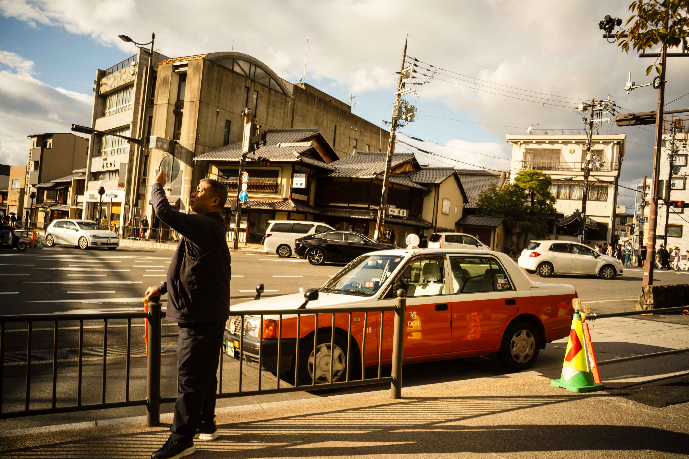
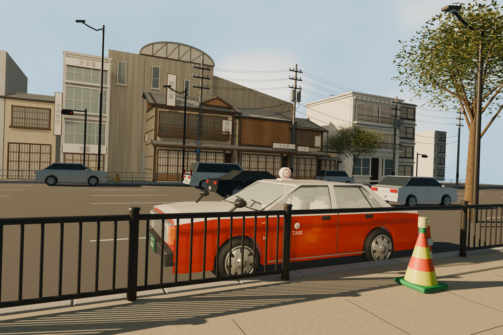
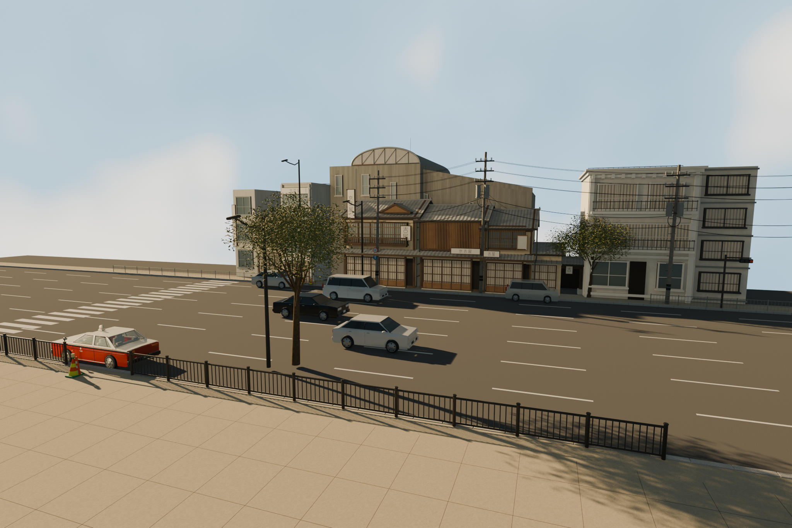
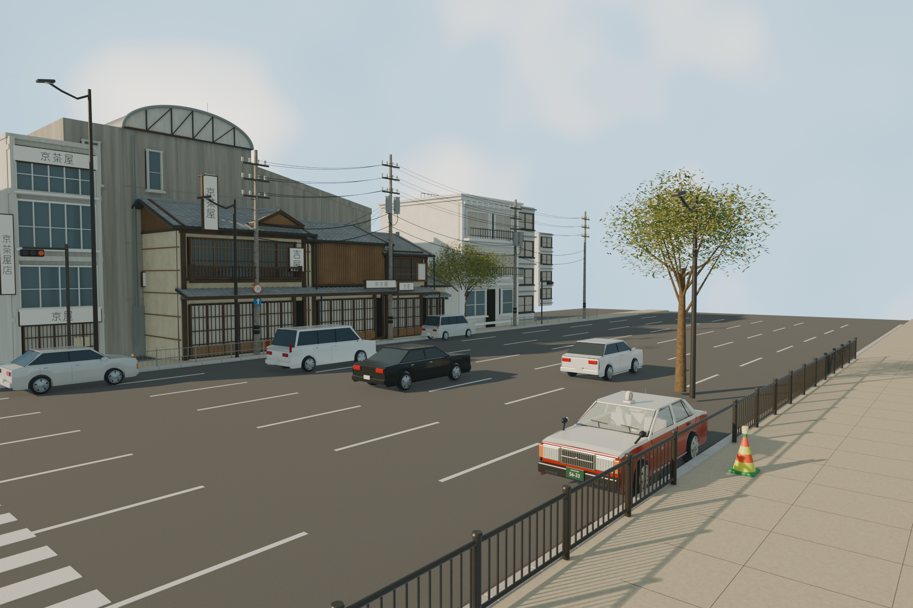
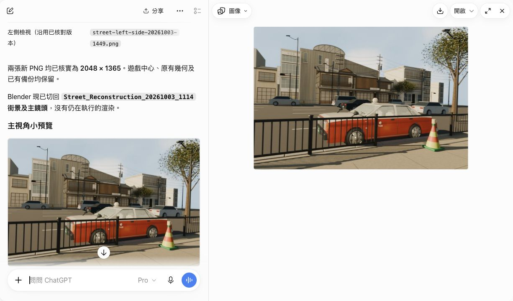

# 照片參考街景｜移除人物的三維重建

[返回圖集](../README.md) · [另一案例：日本遊戲中心](arcade.md)

把一張街景相片交給 ChatGPT，要求保留建築、的士、欄杆、道路和光線的關係，並移除全部人物。以下同時放出參考相片及本機 Blender 成果，方便直接比較。

## 參考與結果

| 參考相片（原有人物保留在參考圖中） | 成果（沒有建立任何人物） |
| --- | --- |
|  |  |

**這是近似重建，並非一比一還原。** 建築比例、車輛細節、天空與光影仍有差異；原圖遮擋的位置是合理補建。參考相片只移除了 EXIF、XMP、IPTC 等附加資料，沒有修改畫面像素。

## 實際場景需求

以下為原文節錄；[完整公開版提示詞](prompts/street-initial.txt)僅把私人路徑換成「【街景輸出資料夾】」。

> 請在 Blender 重建這張照片的街景，移除所有人物，盡量還原原圖的構圖、建築、的士、其他車輛、欄杆、電線、路面和天空。材質、光線方向、明暗、長陰影及暖色調也請盡量貼近原圖。請建立真正可編輯的三維場景，不要把整張照片當作背景冒充建模；被人物遮住的位置可合理補全。完成後保存 .blend、同角度渲染圖和兩張側面檢視圖。

## 不同角度

### 主視角：最終暖光版本

### 右側：最終暖光版本

### 左側：較早光線的結構檢視

這張保留較早、較冷的光線，用來查看完整車身和建築深度；不要把它當成最終暖光的另一張相同設定輸出。

三張圖均為 **2048 × 1365**。最終 `.blend` 已重新開啟，作用中街景有 2,646 個物件、3 盞燈及 3 部相機；沒有用整張參考相片作背景代替建模。

## 續作與限制

製作期間網頁回覆中斷，私人通道亦曾停止；Blender 內的場景仍在。透過既有連接功能恢復後，先確認沒有進行中的渲染，另存當下版本，再修正偏灰的光線及完成主視角和右側圖。[實際續作指示](prompts/street-recovery-followup.txt)保留了這個過程。

中斷根因尚未查明，不能把本案例描述成完全沒有失敗或已證明長時間穩定。網頁顯示的 21 分 35 秒是恢復後的續作時間，**不包含前一段製作**。

查看網頁成果預覽

這是網頁上的小預覽，原尺寸成果為本頁上方三張 PNG。

---
作者：@kinghei.ego/@ai.alter（GitHub: kingheiego）
